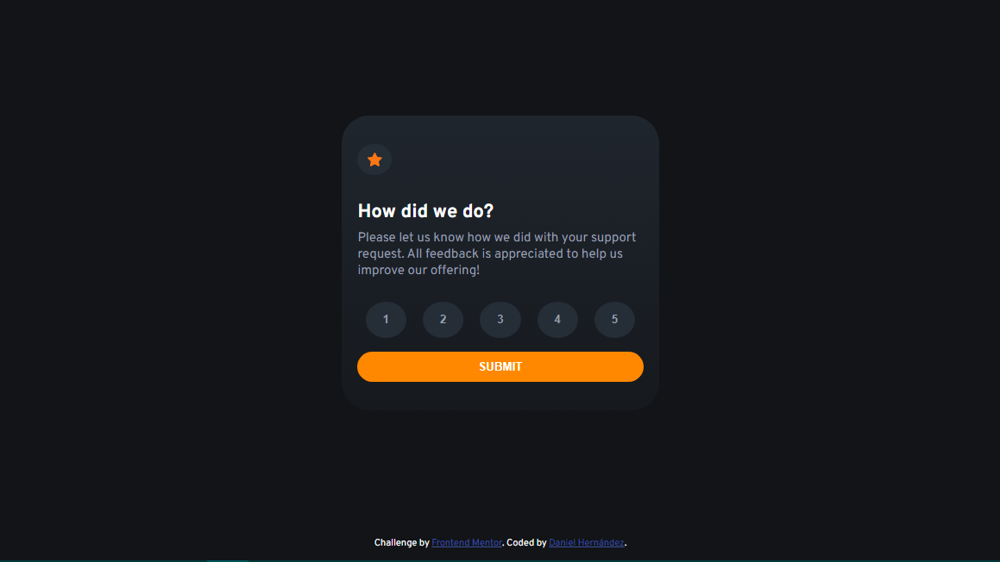

# Frontend Mentor - Interactive rating component solution

This is a solution to the [Interactive rating component challenge on Frontend Mentor](https://www.frontendmentor.io/challenges/interactive-rating-component-koxpeBUmI). Frontend Mentor challenges help you improve your coding skills by building realistic projects. 

## Table of contents

- [Overview](#overview)
  - [The challenge](#the-challenge)
  - [Screenshot](#screenshot)
  - [Links](#links)
- [My process](#my-process)
  - [Built with](#built-with)
  - [What I learned](#what-i-learned)
- [Author](#author)


## Overview

### The challenge

Users should be able to:

- View the optimal layout for the app depending on their device's screen size
- See hover states for all interactive elements on the page
- Select and submit a number rating
- See the "Thank you" card state after submitting a rating

### Screenshot





### Links

- Solution URL: [https://danthvp.github.io/interactive-rating-component-main/](https://
- Live Site URL: [https://danthvp.github.io/interactive-rating-component-main/]

## My process

### Built with

- Semantic HTML5 markup
- CSS3 custom properties
- Flexbox
- Mobile-first workflow

- [Styled Components](https://styled-components.com/) - For styles


### What I learned

This project was ver funny to develop. 
I use the new way to declare rules in CSS.
It was very useful to made the code easier to read.
Also, I learned how to handle the submit event without using space in memory.


I am proud of this piece of code. 
It is simple but it looks nice.

```JS1
form.addEventListener('submit', (e)=> {
    rateMsg.innerHTML = `You selected ${current[0].value} out of 5`;
    rateCard.style.display = 'none'
    cardSubmited.style.display = 'flex';
})
}
```


## Author

- Website - [Daniel Hernández GitHub](https://github.com/danthvp)
- Frontend Mentor - [@danthvp](https://www.frontendmentor.io/profile/danthvp)
- Twitter - [@DanHdez02](https://twitter.com/DanHdez02)
- Instagram - [@danhv_dev](https://instagram.com/danhv_dev?igshid=MzRlODBiNWFlZA==)
